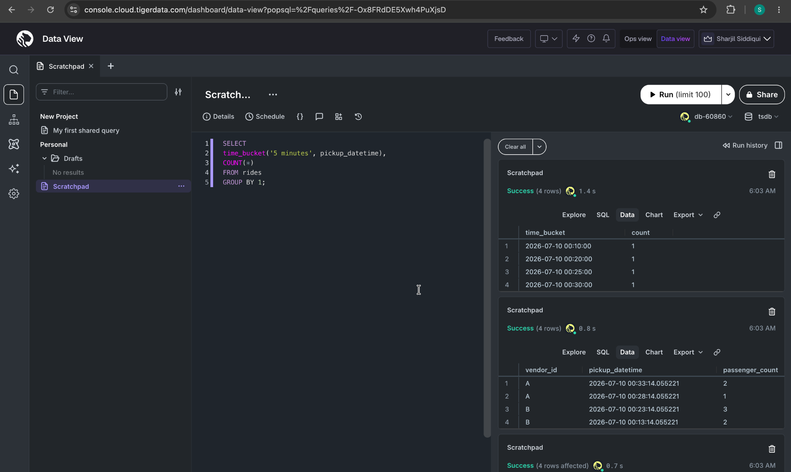

# 🚀 TigerData API Performance Monitor


A small project built to explore Tiger Data (TimescaleDB) before applying for the Database Support Engineer role.

Instead of following only the official tutorial, I wanted to build something related to my own engineering experience.

Since much of my work involves investigating production APIs, authentication issues, and enterprise SaaS applications, I created a small API Performance Monitor that stores API request metrics as time-series data.

---

## Technologies

- Tiger Cloud
- TimescaleDB
- PostgreSQL
- SQL

---

## Features

- Create a TimescaleDB hypertable
- Store API request metrics
- Insert time-series sample data
- Analyze request latency
- Aggregate data using `time_bucket()`
- Compute average response times
- Count API failures over time

---

## Database Schema

| Column           | Description                  |
| ---------------- | ---------------------------- |
| timestamp        | Request timestamp            |
| endpoint         | API endpoint                 |
| method           | HTTP method                  |
| status_code      | HTTP status                  |
| response_time_ms | Response latency             |
| service_name     | Service handling the request |

---

## Example Queries

### View requests

```sql
SELECT *
FROM api_requests;
```

### Average response time

```sql
SELECT
service_name,
AVG(response_time_ms)
FROM api_requests
GROUP BY service_name;
```

### Requests grouped by time

```sql
SELECT
time_bucket('5 minutes', timestamp),
COUNT(*)
FROM api_requests
GROUP BY 1;
```

---

## What I Learned

Through this project I learned:

- How TimescaleDB extends PostgreSQL
- What hypertables are
- How time-series databases differ from relational databases
- Using `time_bucket()` for aggregations
- Modeling production API metrics as time-series data

---

## Future Improvements

- Grafana dashboard
- Continuous aggregates
- Compression policies
- Larger production-like dataset
- Query performance comparisons

## Demo

### Creating the hypertable


---

### Querying API metrics


---

### Aggregating data with time_bucket()


